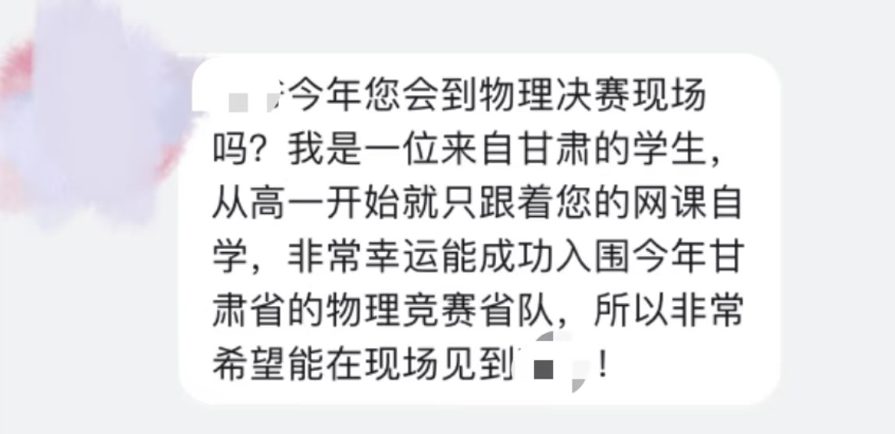
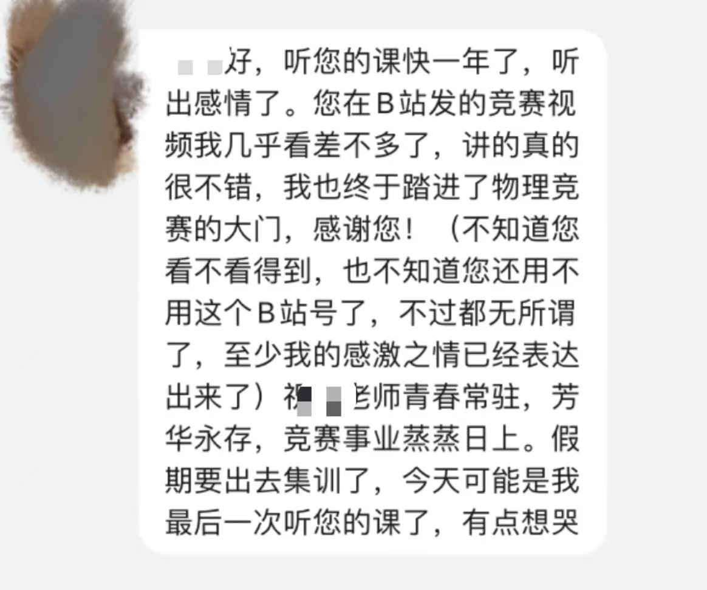

这篇采访的对象是在某高校任职的老师，主要负责讲授大学物理课程，同时他曾兼职做学而思的物理竞赛教练。在“双减”政策影响下，这位老师离开了学而思，将自己的物理竞赛体系完整地保留了下来，并以个人的身份继续做着物理竞赛培训的相关工作。这篇采访会涉及他做竞赛教练的职业生活与生涯发展，对教培行业的看法，以及他对大学知识学习的洞察。

### 职业概述

#### 您能简单介绍一下您的职业吗？
我是06年在学而思教初中数学联赛，后来教高中物理竞赛和强基培训。现在主要在做个人的竞赛培训，属于教培行业吧。

### 职业生活

#### 您能大概描述一下您的工作日时间安排吗？
我觉得这个职业是比较自由的。如果是在机构里的话，平时应该会有教研工作，但是真正自己做竞赛教练教竞赛的话，在起步的时候肯定是要比较费劲的。这包括平时要提前准备，要做题，要思考怎么讲这些东西。但是其实教师这个行业，尤其是教培，它的内容是相对固定的。它就像是那种职业培训，就要针对培训的这个职业去专门进行一些准备。所以说基本上在最开始的时候还需要准备，到后来的话平时其实都不需要准备，你只需要等工作时候去直接讲课就可以了。所以这个职业是随着经验和时间的积累会更加游刃有余，上手也更容易。至于具体我的时间安排的话其实比较复杂。在06年刚开始在培训机构的时候，其实就是周六周日和寒暑假上课；平时周一到周五就比较自由。我在开始起步的时候需要琢磨备课，去思考怎么讲的更清楚，让大家听得更明白。有了经验之后备课也省了，这样一年授课的课时大概在1000小时左右。所以其实比公立学校的大学老师授课强度是大的，因为正常大学老师可能一年下来100 小时课，但是培训机构老师一般得需要1000小时。从教培老师的角度来说，其实自由度大只是一方面，不太好的另一方面是我们的工作时间和别人的工作时间是岔开的。换句话说，在别人放假清闲旅游的时候，你可能得天天上课，这就会导致这个职业最主要的一个问题——等将来成家了之后，两口子的上班时间错开，其实无论是带小孩还是家庭出游都不太容易找到共同的时间。

#### 您在工作中最有成就感的事情是什么？
最开始确实是跟收入有关的。我做教培06年到现在得有18年了，其实我感觉是比较苦的，如果没有一定的收入回报很难坚持下来。在我的认知范围内，做教培起家的其实有一些是家里条件不算很好，通过做家教来在大学期间勤工俭学挣补贴。所以你看像新东方的俞敏洪，还有学而思的张邦鑫，其实这个行业里大部分人的条件并没有那么好，大学期间有一定的经济压力，在这种情况下会选择去从教培做起。我认识很多人最后坚持不下来，一方面是觉得付出跟回报不成正比，另一方面也确实比较苦比较累。我最开始06年在学而思兼职的时候，当时在北大读大四，每天骑着车去公主坟，讲一次课三小时赚二百块钱，连续四十天风雨无阻。家里条件稍微好点的没必要做，条件差一点的很多坚持不下来，所以教育行业大部分人都比较年轻。 
那另一方面当然就是学生成绩的提高。而且我在B 站上是有一些竞赛培训视频的，所以其实每一次考完试之后我都会收到一些站内信。物竞复赛前几天也考完了， 很多省市现在已经公布省队了。这几天就有同学给我发消息，说我是来一次一位来自甘肃的学生，从高一开始只跟着您的网课，然后非常幸运入围了今年甘肃省的物理省队，我觉得这就算是一种成就感。无论是上过我的课的，就是不管是机构付费还是B站免费的，只要有一些好的归宿、好的结果的，我都会感觉比较有成就感。当然也不见得说每个孩子的好结果都是非得去清北或者去这去那的，我觉得只要他在学物理的过程中爱上了物理，诶，觉得挺喜欢这个物理学的，等到将来上大学的时候，在数理基础课学习的时候觉得有帮助，在潜移默化中能影响到这种数理思维，我觉得就是一个比较有成就感的事。我在最开始搞教培的动机就是去赚到钱，那后来在教培过程中，遇到了越来越多的孩子们有学物理的这个需求，而我有这个能力，我们完成互相成就，这就是我能坚持干下去的理由。

#### 您方便聊聊您那边的团队文化或者企业文化吗？
我接触到的也谈不上团队文化吧，因为我其实跟他们接触不多，当时是个兼职老师，不需要坐班。我觉得这个企业文化的问题的话，就我个人理解来看，首先他能做大做强的一个原因就是把它流程化和规范化了。他不需要各科老师的水平有多么强，因为他有一套自己的教研系统，在培训老师的时候其实都是很千篇一律的样子。这个跟新东方有区别，新东方就是每个老师都很有个性，但这个学而思老师就好像都差不多。只要这个教研系统水平够强，讲义够强，培训出来的老师其实都差不多，走的是类似于麦当劳肯德基的那种模式化的培训。然后我感觉当时对企业员工的关怀也还算不错的，但是后面其实就有点心有余而力不足了。因为最开始的时候认为教培老师相对公立学校老师没有归属感，他觉得不稳定，比如没有编制和稳定的收入。那当时他为了解决这个问题干了一件事，就是入职之后五年、十年这种，会有一个阶梯，然后每一个台阶会给老师的子女有一些优惠，比如他旗下所有的品牌都可以有免费上课的优惠。同时他有个退休计划，相当于给老师也定级，有点像我们公立学校老师定高级老师特级老师这种，将来类似于退休金给你上保险，就是相当于退休金一个月多少钱，不是靠国家，就是靠他给你上保险。我觉得他的出发点是好的，因为作为培训机构怕这些老师没有归属感，想搞的像公立学校一样，给他们足够多的这个福利。后来实施了一阵子实施不下去了，所以又逐渐的就把这项政策给取消了，回归现实，他做不到这么多人同时给这么多有福利。具体的企业文化我也不是太了解，接触到的这些政策吧，有一些我也算不上是很认同，就是兼职在里面讲一个小时课拿一个小时钱，没有太深入这个企业本身工作。

### 职业发展
#### 您当时为什么会选择去机构做教培呢？以及您现在为什么会选择从机构出来，做个人竞赛教练这个职业呢？
我就觉得能够能够选择去做教培的多多少少就有点勤工俭学的成分。就是学习还行，家里的条件一般，然后还有赚钱的这个意愿。这种情况下是比较容易上手的。真正上手了之后就会就会比较累，所以还能够坚持下来的，一方面当然可能讲的还不错；更关键的就是你吃的了这苦。我们当时正常就一天讲十个小时，周六周日二十个小时，一年赚个十万二十万的也是一天十个小时十个小时的讲。而且我觉得最关键的其实不光是因为钱，就是你得确实感兴趣，或者说讲课可以给你带来愉悦感。说白了就是愿意聊天、愿意说话、愿意输出、愿意让别人认可。你看到所有的教培行业里面的所有的人可能都是刚毕业的年轻人，二十岁到四十岁最多四十岁上下，上年纪的基本上讲不动。而且以前在以前线下讲课，站着说话腿会静脉剧张，还有脖子、颈椎、声带啊，还有慢性咽炎这种职业病，这都是问题。 所以我觉得能选的就是开始家庭条件不行，有赚钱的动力，还得能吃苦，学习还不错。我刚才跟你说的俞敏洪张邦鑫都是这么出来的。还有一点就是，我觉得教培行业最大的压力可能来自于家庭。父母有的时候观念更老旧，他觉得你如果考个公务员，去个有编制的或者说你有稳定的收入这种会更好。教培在以前看来不是正经行业，或者说就是肯定不如编制老师好。所以说一方面如果毕业选择这个行业，我觉得一方面是家里可能不认可你的职业，第二就是大环境下的机构其实不能保证长久给你这个稳定的平台。因为你看双减之后很多老师就没有回去了， 所以一个人在教培行业能否立足还取决于你有没有一个各方面的技能。所谓的各方面就是你除了讲课之外，你得有教研能力，你得有讲义，你得有学科的能力，你得自己招生。如果你把其他能力也锻炼好，没有什么短板的话，作为个体老师 其实挺舒服的。你就可以不是光教最高端的竞赛，你可以去看哪个市场需求最大， 而你又有这个能力，这样就能很容易招很多学生。比如我自己弄的时候，曾经一个班有两百八十人的，那个收入就很高。所以说你自己弄，你只要有这个能力，然后适应市场需求，包括教研、招生、学科这种你都得搞定，那就全才了。起步去教培机构挺好的，因为机构都给你准备好了，但是也别指望太多，两百万就到底了，也别指望长久，讲着讲着就讲不动了。所以肯定是培养教学的能力的同时 兼顾其他能力，这样我觉得才是长久的。你指望着平台的给你一个长久的是不行的。除非是在线大厂。在大厂的是这样，就即使你的年薪是两百万到五百万，但是你的成本占到学生的学费应该是不到1%2%。举个例子，有的大厂的老师大概学生能到一万到两万吧，那么算下来一期课收上来的学费大概是再乘以两三千 也就是说得有大概三千万，那么一年三百万的收入，一期课其实也就是八九十万 那么八九十万你去除以三千，也就是百分之一二成本。这种情况下他是不会动你的，因为第一，你占他成本不高；第二呢，你的质量很重要。但是大量老师到不了这水平，现在都清北都不要，他背景上都得要求哈佛耶鲁这种。但是如果你的学生少了，或者说有更年轻的、更厉害的能替代，到时候也有可能会被裁。这个时候反正培养自己各方面能力是最重要的，最好能自己做闭环。如果你只是给别人上课，自己什么也不管的情况下，那你就要接受他剥削你然后随时淘汰你的可能。而且收入肯定不是单独的一个指标，有的人还是很有责任心事业心、很有国家荣誉感和使命感的。像我们搞科研的很多老师就是觉得能够给国家培养人才 就是很欣慰的，我觉得这样当然非常好了。

#### 您觉得您现在工作的成长性怎么样？
我觉得一是老师，二是医生。这两个还是相对来说越老越吃香的，但是如果是教培的老师，他涉及到一个问题就是体力跟不上。这个成长性就看你怎么理解了，你如果从老师医生这角度来说，成长性很好；公立学校老师肯定成长性好，培训机构的话也看经验。但是培训机构的观点重点在于两件事。第一，你的课程是否吸引学生；第二，你的课程能不能提升学生的成绩。你吸引学生，学生才愿意听你的课；你的成绩也得提高，不提高成绩家长肯定就不认可了。所以说这两件事决定了年纪太大的可能不太合适。但是还是那句话，教培行业其实没必要追求一辈子的稳定。如果假设我用5年到10年的时间赚出稳定工作内30年40年包括退休金还多的话，然后再有自己合理的规划，比如理财，那其实也挺好。所以我感觉年纪大的情况下不太适合长期的做教培，也不太适合带大班。很多人是之前的高收入其实已经可以足以抵抗你后面的不能继续的风险。所以很多人40岁就不讲了，这很正常。还有在大环境现在经济不景气的情况下，我个人觉得教培还是比较顽强的。如果你做硬件、做产品的，你得先花钱买材料，你得有工厂生产 ，你还得有仓库存着；等你卖出去了，这货出去了 ，钱还不能来，这只是应收账款，对方还没付，这个周期很长。一个环节出问题就都出问题了，服务业也有这个问题。而且在这么一个大环境的情况下，我感觉父母在收紧各方面消费的时候 最后收紧的才是子女的培训经费，家长仍然还是愿意花钱去买你的教育服务。所以我个人感觉，在经济不好的情况下，这个行业还是相对来说比较好的。许多行业都在起伏，但是教培似乎始终没有问题，就是政策在打压。政策打压的本质其实就是因为这个行业太火了，高风险高收益吧。

#### 您方便透露一下您这行的大概收入吗？
方差很大。一般来说，如果是刚毕业的学生的话收入是比较高的，去培训机构的话，起步一般20到40万。培训结构有两套体系，第一套体系是线下面授。这个体系下一般天花板比较低，大概在一两百万左右。第二套是在线课，有了这个所谓的网校，包括像作业帮猿辅导，这种资源就相对集中一些。这种体系的主讲老师相对需要的少，但是学生又特别多，所以在线课的老师收入就比较高，天花板就能够到500万年薪。当然线上要求也高，现在就是宁缺毋滥。以前要求是清北，再后来清北都不行了，都得哈佛耶鲁了。现在的大环境很卷，年轻人招进来起步基本上80到100万，天花板大概估计在300万左右就是比较高的。不过这个也分学科，一般数学学科是最好的，物理跟英语其次，然后剩下的也不一样。所以这行收入最少的20万，最多的可能几千万一年，那这就不好说了。这就有点像创业这种，相对来说来钱短频快。我在学而思的时候，最早是一个暑假讲了40天课，也就是8000块钱；从10年回国之后，每年大概从开始5万，后来10万，后来20万 40万 最后100万 200万，到了21年也就是双减前，大概200万出头吧。个体老师里比较好的就是1000万，那更好的就是去流量平台去买流量导流的，这种能够到一个亿的营收，个体老师分到的钱应该是3000万。所以这个方差很大。机构的基本上300万就是天花板了。

#### 您觉得“双减”政策这个冲击对教培机构和老师们来说算是挑战还是机遇呢？“双减”之后教培行业形势如何呢？
我觉得首先当时这些大机构肯定还是给家长造成太大焦虑了。而且当时小升初的那些比赛，还有在竞赛集训队的，这都能帮助推去重点中学比如北京六小强。而一旦有这种渠道，家长就会很焦虑，觉得别人上但是我没上，或者说没在这圈子里面就上不去重点中学。双减的话，我是觉得是这些教培机构做的太大了，他都冲击到公立的教育系统了，那有些家长甚至更认可教培机构而不认可学校里的老师。但事实上呢，你要知道学校老师他们要做的事，第一是要系统讲知识，他不可能光短频快的给你讲解题技巧，那都不能叫教育了；第二是学校老师事情会比较多。他不是光讲课，他可能还有作为班主任的各种事。所以教培机构确实因为高薪吸引了一帮水平还不错的老师，但是这样对国家对社会肯定是不行的，所以肯定要管嘛。管，我觉得管还是挺好的，就是把这个热度降下来，省得这个大家都很焦虑。但是大家的观点是，这样做似乎也没有让大家焦虑降下来很多，因为大家可能最后还得想着得上好小学升好初中，初中升好高中之类的，这个需求还在；然而这个资源和这个学生争取的还是不匹配的，所以很多家长还是选择去鸡自己的娃，所以即使打掉了像学而思跟新东方这种大头，那些小机构就又重生了。但是我觉得其实北京整个教育系统相对来说还是比较健康的，最优秀的资源还是在公立学校，能力够强的话肯定还是可以上的。但是有的地方那些最优秀的资源都已经是私立的了，如果不花那些钱可能根本就接受不到好的资源。然后这个行业现在的情况的话呢，以前资本市场看中就喜欢投资，然后这个行业当时想法是，我就算不赚钱，我也得把市场占有率提高，把数据搞好了之后在上市的时候再圈钱和吸引投资人，这个就导致一个结果就是恶性竞争，就基本大家都赔本。你比如说暑假搞零元课，搞一元就可以上所有课这种，他其实就是互相竞争的一个结果，包括在线课在内。就是你可能有一个19 块钱体验课，那发的那些材料成本都不止19。他就是为了把这个盘子先做大然后吸引投资最终上市之后再圈钱。但是现在这个培训机构不让上市了，所以大家这方面更理性，相当于就是你如果就光把数据做好，然后流量很大，但没钱，那不就把自己搞玩没了。所以以前在最开始搞出在线课的时候，几个大厂，包括学而思网校、猿辅导作业帮这些，他们是大量的投钱，就钱都让谁赚走了，像什么抖音这种投流的平台给赚走了。那他们投了流量，然后把学生吸引过来，一步一步转换到自己的正课学生，其实最终最后没什么赚钱，就是投一块，赚回来的可能就八毛，可能还得亏两毛；然后国家这一管呢，他们反而盈利了。就有点像以前我们有一个说法叫博弈嘛，就是这个囚徒困境，像这个烟草商巨额做广告，然后大家都亏，因为广告费太多了，要是我不做广告，但你做了，那你就把市场占走了。后来国家出台不能做烟草广告。那么反过来他们反而盈利了，但是他们学生规模变少了。这个对于机构领导来说不是好事，因为他们想快速的上市圈钱套现，因为他们有手上有大量的期权；但是他们没有主讲老师赚钱多。比如主讲老师就是讲一年赚一年钱，比如200万；他们管理层就50万到100万，但他们期权多，只要上市了能变现了。那现在的结果就是老师的整个收入降低了，这个领导层的期权也废止了，公司没有上市的可能了。所以总体来说机构更规范了，大机构没办法“消化”那些能力强的老师，这个就导致小机构或者个体老师的生活反而更滋润了。这更滋润的话就体现为，比如说我要在机构可能200万，那我现在自己讲就能到1000万，税率也没那么高。所以这个事是好事还是坏事这不好说，有的人觉得反而是个机遇。“双减”下来之后，一开始在机构上课的老师觉得这绝对完蛋了是吧，但是生活中有时候你看上去是遇见了一件坏事，其实最后发现他反而是有利的，这不好说，凡事都得辩证来看。

#### 现在许多人会存在一个忧虑，认为报课外班会导致孩子的学习能力下降，课外培训似乎逐渐在和学习能力差挂钩。请问您对此怎么看呢？
我觉得最强的孩子确实应该是自学能力很强的。他不能光被动接受这些培训，真正的高手还是培训不出来的。就是说白了，孩子如果掌握了足够强的学习能力，他是可以自己去更新的。所以我觉得培训是能够提高你的学习效率，但你最终还是要主动的去刷一些书、看一些题，反复去总结思考。就好像是在大学里面专业课学不明白了，那还怎么参加培训，就没有培训这事儿了，早晚是要靠自己的自学能力。不过这个也看领域了，如果说纯教培的补习，课外班可能会导致一些孩子不愿意在课上思考和课后总结，就等着课外班老师讲，这个从长期来看肯定是弊大于利的；但是如果在竞赛这个领域的话，竞赛培训现在已经高度专业化了。这个领域纯靠自学基本不可能出成绩，这一点做的是不太好的。因为以前我们搞竞赛或者说国家弄这个奥林匹克竞赛选拔人才，那肯定不是希望你功利性地经过一波训练。他更希望是通过一个选拔把这些感兴趣有能力的孩子选拔出来。但是既然有选拔就会有利害关系，就会有培训。而且现在竞赛很卷，基本上高度专业化了。专业化的意思就是说，比如上海或者北京，以前的数学物理竞赛，如果是省队的学生可能分布在七八个学校里面；逐渐现在收拢到可能就四五个学校，甚至到省队的时候就两个学校，甚至就一个学校。你说其他学校的学生没有聪明的吗？那肯定也有，但是这说明如果你不在这个圈子里，不通过培训，确实你很难能够被选拔出来。这件事我觉得确实是不好。现在已经把这利害关系降到很低了，就是全五十名才能保送；但是只要有利害关系就有寻找培训的这个动机；只要有这个动机就会有市场，再加上现在越来越专业化，导致外人也进不来，就是形成垄断。事实上我是觉得，如果你把竞赛彻底的脱钩于高考保送，那个时候还愿意学的人，才是真感兴趣的，即使很难做到。 
培训这个事是很泛的，你比如说教培可能偏向于文化课，但是本身就是培训行业 那就很多了，就会包括各种技能，你像滑雪轮滑这种报个课外班我觉得无可厚非，因为肯定还是人家更专业、教学更安全嘛。但是如果当经济环境差的时候，这些需求就会被压缩。至于你说强调没上课外班来证明自学能力，我觉得这个不重要。自学能力强的人，尤其是顶级的这种竞赛培训出来的，它是需要引领的，纯自学几乎不可能。我想不到任何一个人是纯自学出来的。你就算是自学，你肯定也是看了一些视频课；你如果完全靠自己，现在竞赛想进国家集训队根本不可能。但是单说高考，这是完全有可能的，有的人学习能力确实强。所以我觉得不必过于强调这件事，也不算啥好与坏之分。能出成绩的人都是自学和培训一起下手，至于能够到达的高度可能会比较取决于后期的自学能力。

#### 您当时为什么会选择把视频课放到B 站上呢？
有很多考虑。比较现实的考虑就是担心有22年“双减”这一天。你可以认为学而思是一个平台，虽然有老师，也有有需求的学生，但是大家就在这个平台上撮合了，然后形成了班级，形成了教学的输出，形成了一个闭环，但是一旦平台垮了就都没得谈了。当时在学而思当时上课的时候，一方面是方便没来上课的孩子们看回放，我就自己录屏放到网上；另一方面也是想着如果哪天学而思倒台了，或者学而思把我辞退了，我有能力能直接接受到学生。但其实后来发现B站也并不能给我吸引来学生，不过帮助了许多接触不到优秀教育资源的孩子们，比如像刚才那位甘肃省省队的同学。所以我一开始的出发点其实是自私的，但是结果是普惠的，我觉得就挺好。但是现在来说更多人开始讲究流量了，如果说流量质量高的平台，比如小红书，那么就不需要在上面讲知识，要在上面讲学习方法来制造焦虑。所以小红书其实是一个很焦虑化的平台，你看上面很多都是那种看起来非常高知的内容来吸引家长。举个例子，他们会说你这个孩子只要跟我这么学，一定没问题，就类似于这种方式让家长认可你、信任你，然后自然而然报你的课，这就是流量变现。B站这个平台的话，我个人觉得，除非是大流量主那种，小up主其实不太可能带来过多的财富收入。但是像小红书这种，虽然粉丝少，但是相对来说质量会高一点。这就是粉丝质量的问题。

#### 现在很多大学老师也会将课程录屏也放到这些网络平台上，比如中国大学MOOC，B站这些。我们也由此看到了一些搬运的国内外的高质量课程，知识似乎理应没有边界。请问您对此怎么看呢？
MOOC应该是为了完成国家的一些项目，就是大学老师完成了MOOC课程任务可以作为他的一个成果。至于录课这个事，我觉得是这样：大学的课程, 从知识上就更丰富多彩一些, 而且免费的资源更多一些, 所以像大学虽然有考研培训,其实不容易做得跟中学这种高考培训规模似的，这个很正常。但是你要说小学生看视频课，看着看着就睡着了。课堂的互动过程对孩子是有用的，但越是到了后面呢,大学生们的学习能力越来越强,可能就越不需要这种互动, 他只需要知识讲干货。知识本身是没有边界的,有差距的是讲授知识的方式。所谓大学的边界，就听课这块而言，授课效果其实很大程度上也取决于学生的水平。老师授课和学生听课这是个互相成就的过程。高质量的课程可以带给学生启发，但是有些课他本身也要求你有比较强的学习能力。如果你能力不到，可能搬运的那些课你也未必听的懂。有的知识它就躺在那些书里，你上网上搜那些大师写的书，其实都能接触到这些知识，但是高质量课程创造的价值就在于，他让这些知识变得更容易接受了、更立体化了。我们并不是在创造知识，我们更多地是把这个体系讲给学生，去打破知识和学生们理解范围之间的边界，这个我觉得是更恰当的说法。

#### 随着网络上有越来越多的视频课出现，许多大学生会选择平时摆烂不听课，等着课后看B站或者期末看速成课，您如何看待这种现象呢？
看课这个现象很普遍，你比如说讲高数的那位宋浩老师，可能部分学校里老师的高等数学的课程讲得确实不如他, 这很正常。大学为了保证自己的成果, 他就得抓老师的科研成果,重视科研，所以教学这块质量未必能有普遍保障。那作为学生，无论通过什么渠道,核心就是得学知识,你得把这个东西学会了。那期末看速成课的就是另外一码事了，那可能学生自己平时就没有想把这课学好的心思，就等着最后不挂科，那就不是我们能讨论的了。你要不然就自己学, 你要不然就是找网上搜索资源, 其实这个时候你的主动性更强；你要是被动的坐在教室里面,很多学生也不会珍惜。就比如我讲大学物理,那有的人都不来,那来了也没怎么听, 那我心想，那我要是在高中讲培训的话,那五百块钱上一次课倒是都愿意来,免费反而不要了。我也不会因此不好好讲, 但是挺多学生就是不会珍惜。大部分情况下, 大学老师在讲课程的时候是给不了他成就感的,甚至是有挫败感的。你还得锻炼好心理素质,就得承受着学生低头看手机,或者快睡着了,或者又要出去上厕所的这种事。总之优秀的课堂永远不是说老师讲的多么多么精彩就够的，他也需要和学生互动，或语言上或精神上，他需要收到学生的正反馈，这样才是一个优秀的课堂。无论是竞赛带学生培训，还是课内讲大学物理，其实都是一个道理。

### 关于大学生
#### 您对大学生有什么建议吗？
扎扎实实一步一步来，尤其是数理领域的学生。你要是数理基础不行，你可能连别人在讨论什么问题都不知道。你回看物理领域的发展历史，百年平庸才是常态，那真正井喷式出成果的时候不过几十年。放到个人也是如此，大部分时间你都是平庸的，可能一辈子会有一两次高光，但那也是难以预测的。你要做的就是在平庸的时候一步一步走好，会遇到一些困难，但是也都无所谓的。有句话叫沉潜十年嘛，遇到困难不妨多给自己一些宽容，换一个参考系看问题会比较有帮助的。

如果您对这篇采访的内容感兴趣，请联系：gdq20050321@163.com

<em style="color: gray;">本篇访谈未经允许，禁止转载</em>
